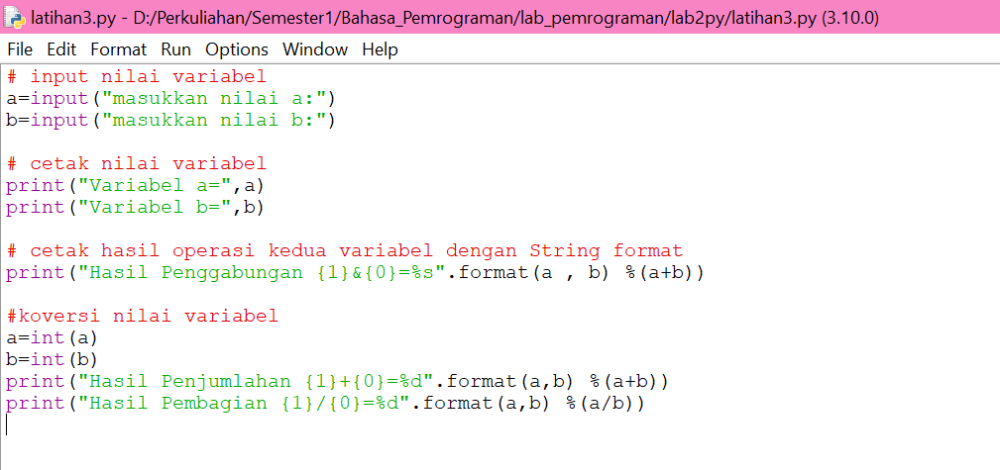

* LAB2PY
Nama    : Febriyani Nurhida
NIM     : 312210222
Kelas   : TI.22.A.2
# LAPORAN PRAKTIKUM BAHASA PEMROGRAMAN PYTHON
* sebelum masuk ke lathian, kita harus mempersiapkan tools-tools yang kita butuhkan diantaranya
1. Python
2. Python console
3. IDLE
## Instalasi Python
* Bagi pengguna Linux, Python tidak perlu diinstal. Karena Sebagian besar distro Linux sudah menyediakannya secara default
* Bagi pengguna Windows, Download di situs resmi python (python.org). Ikuti langkah instalasinya

* Setelah berhasil di download, selanjutnya adalah proses installasi.
* Double klik pada file installer python yang sudah di download, atau klik kanan lalu pilih Run as Administrator . Jika muncul warning Run as Administrator, silahkan pilih Yes.
* Centang Install launcher for all users dan Add python to PATH.
* Kemudian klik Install Now

* Tunggu proses installasi sampai selesai.

* Installasi selesai jika sudah muncul “Setup was succesful"

* Test dengan menggunakan CMD. Coba jalankan perintah
`` python --version``
* Jika muncul informasi versi Python yang di install maka Python sudah berhasil di install dan tidak perlu mengikut langkah selanjutnya untuk menambahkan path python pada environment variables.

# LATIHAN 1
## Menjalankan Python Console
ketik `python`

*  Menampilkan tulisan “Hello” dilayar
`print("hello")`

* Menampilkan tulisan “Saya sedang belajar python” dilayar
`print("Saya sedang belajar python")`


# LATIHAN 2
* Menjumlahkan dua buah bilangan menggunakan variabel a dan b.
* Mendefinisikan variable a dengan nilai 8
* Mendefinisikan variable b dengan nilai 6
* Mencetak nilai variable a dan b
*  Mencetak hasil penjumlahan a+b
``` Python a = 8
b = 6
print ("variable a=" ,a)
print (variable b=" ,b)
print ("hasil penjumlahan a+b=" ,a+b) 
```


# LATIHAN 3
## Menjalankan IDLE
* Membuat file baru dengan nama latihan3.py (pastikan lokasi file pada folder lab2py pada direktori kerja anda).
* Menggunakan fungsi input untuk mengambil nilai variabel dari keyboard.
* input nilai variabel :
``` python
a=input("masukkan nilai a:")
b=input("masukkan nilai b:")
```
* cetak nilai variabel
``` python
print("Variabel a=",a)
print("Variabel b=",b)
```
* cetak hasil operasi kedua variabel dengan string format

`` print("Hasil Penggabungan {1}+{0}=%s".format(a,b) %(a+b))``
* konversi nilai variabel 
``` python
a=int(a)
b=int(b)
print("Hasil Penjumlahan {1}+{0}=%d").format(a,b) %(a+b))
print("Hasil Pembagian {1}+{0}=%d").format(a,b) %(a/b))
```
* berikut ditmpikan kode dalam IDLE editor


* berikut ditampilkan hasil output nya


* sekian dan terima kasih :)